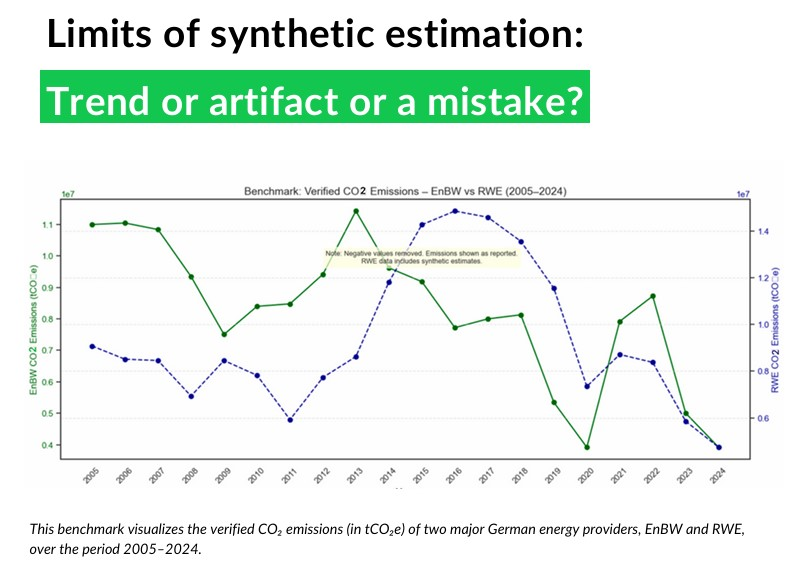

# 🌍 Climate Risk & Carbon Footprint Analysis (Sustainly Case Study)

> **Executive Summary:** A data-driven deep dive into the carbon footprint and climate vulnerabilities of energy giants RWE and EnBW, blending environmental indices with financial risk modeling.

---

### 🎯 The Challenge
I was tasked with quantifying climate impact on energy operations by focusing on three areas: **historical emission trends**, **physical asset risks** (like water stress), and **future financial exposure** to carbon pricing.

---

### 🔍 Data & Methodology
I cross-referenced verified emissions with global climate benchmarks:
* **[EU ETS](https://sdi.eea.europa.eu/data/76f260d6-2d41-4dfc-b0de-ee1fd3ee74f2):** 2005–2024 verified GHG data.
* **[EDO (Drought)](https://data.jrc.ec.europa.eu/dataset/12a852fe-8a43-4d04-9c75-1d3ef2ac673c):** Facility-level water stress mapping (SPEI index).
* **[World Bank](https://carbonpricingdashboard.worldbank.org/):** Carbon tax trends and global compliance costs.

---

### 📊 Emissions & Risk Benchmarking

*Comparative analysis of RWE and EnBW emission trends (2005-2024) and projected carbon compliance costs:*

---

### 📝 Strategic Narrative
To turn raw numbers into risk insights, I first built a reliable 20-year projection by filling data gaps with a **Forward/Backward Fill** logic. I then mapped facility coordinates against **EDO drought data**, which revealed high-risk "hotspots" in North Rhine-Westphalia. Finally, I modeled 2030 carbon price scenarios to show how RWE’s higher emission intensity makes it more vulnerable to regulatory shifts than EnBW.

---

### 💻 Technical Implementation
Final project at Sstainly analyzing RWE & EnBW’s climate risk. Built via a hybrid Python-Excel framework:
* **Data Engineering:** Used Python (Pandas) and Forward/Backward Fill logic to reconstruct 20 years of emission data.
* **Geospatial Analysis:** Used **Folium** to overlay facility coordinates with climate risk layers.
* **Strategic Focus:** Prioritized Forward-Looking Financial Exposure and business logic over static scripting to show how climate data drives corporate strategy.

---

### 🚀 Key Insights
| Metric | Analysis Result |
| :--- | :--- |
| **Financial Risk** | Compliance costs could top **€16B/year** by 2030. |
| **Physical Risk** | Critical drought exposure for key NL and DE facilities. |
| **Comparative** | RWE faces higher regulatory sensitivity than EnBW. |

---

### 📊 Final Output
The full report includes detailed risk maps, synthetic data logic, and strategic mitigation steps:

👉 [**Open in Browser (Google Drive)**](https://drive.google.com/file/d/1XT2-FhqhpOt3_lJ_73E-xkE4KhBAGCC5/view?usp=sharing)
👉 [**View Repository PDF**](./Outcomes.pdf)

---

### 🛠 Tech Stack
* **Tools:** Python (Pandas, Folium), Excel (Financial Modeling).
* **Skills:** ESG Risk Assessment, Carbon Pricing, GIS Mapping.
