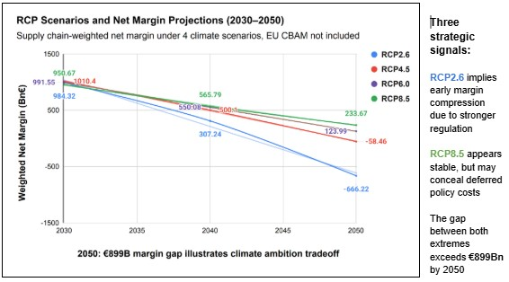
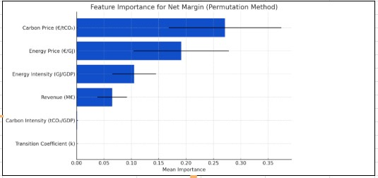
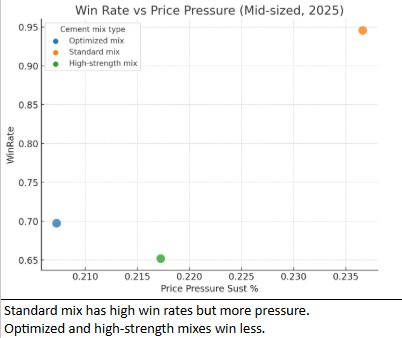
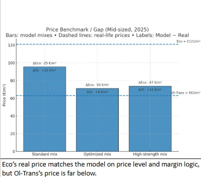

# 🌍 Transition Risk & Unit Economics under Climate Policy  
### Scenario-Based Margin Stress Testing (Transition Master Case Study)

> **Executive Summary:**  
> A scenario-based analysis translating climate transition risk into company-level margins and unit economics.  
> The project combines IPCC-aligned policy pathways with financial modeling and real-market illustrations to show how carbon and energy price dynamics reshape industrial profitability through 2050.

---

## 🎯 The Challenge
The goal was to connect climate policy with financial performance by answering one core question:

> *How do different climate transition pathways translate into margin pressure at sector, company, and unit level?*

The work evolved across four layers:
1. Regulatory transition risk  
2. Scenario-based financial modeling  
3. Company-level exposure  
4. Unit economics under real market constraints  

---

## 📂 Datasets Used

This project combines **publicly available climate and economic datasets** with **scenario-based modeled extensions**.

### 🌐 Public & Institutional Sources
- **IPCC AR6 (RCP 2.6 / 4.5 / 6.0 / 8.5)** – climate transition pathways  
  https://www.ipcc.ch/report/ar6/syr/

- **World Bank – Carbon Pricing Dashboard** – ETS and carbon tax benchmarks  
  https://carbonpricingdashboard.worldbank.org/

- **IEA – World Energy Outlook 2023** – energy price trends and transition narratives  
  https://www.iea.org/reports/world-energy-outlook-2023

- **National Accounts & Industry Statistics** – baseline revenues and sector weights  
  - USA (BEA): https://www.bea.gov/data/industries  
  - Canada (Statistics Canada): https://www150.statcan.gc.ca  
  - Germany (Eurostat): https://ec.europa.eu/eurostat  

---

### 🧪 Modeled & Derived Data (Excel-Based)
- Carbon and energy intensity trajectories (2020–2050)  
- Scenario-specific carbon and energy price paths  
- Transition coefficient representing regulatory pace  
- Company-level cost structures inferred from sector averages  

> Some datasets are scenario-derived to support forward-looking analysis rather than historical precision.

---

## 📊 Regulatory & Scenario Modeling

**Weighted Net Margin Evolution Across Climate Scenarios (2030–2050)**  

*Margins diverge by transition timing, with early compression under aggressive mitigation and deferred risk under weak regulation.*

---

## 🧠 Driver Importance Analysis

**Relative Impact of Transition Variables on Net Margins**  
*Machine Learning: Random Forest feature importance*

*Carbon and energy prices dominate margin outcomes across scenarios.*

---

## 🏛 From Regulation to Company Cost

**EU ETS carbon pricing vs. company compliance costs**  

*While Scope 1 emissions decline in line with corporate climate targets, rising carbon prices cause compliance costs to peak between 2025 and 2040 before declining.  
This highlights the timing mismatch between decarbonization pathways and regulatory price dynamics.*

---

## 🧮 Unit Economics – Core Carbon Cost Impact

**Carbon Cost per m³ vs EBITDA Margin After CO₂**

*ETS-driven carbon cost escalation leads to a sharp EBITDA margin compression around 2030, 
highlighting the non-linear impact of transition costs on unit profitability.*

---

*Optimized and high-strength mixes retain higher win rates under price pressure, while standard mixes lose competitiveness faster.*

---

### 🔹 Modeled vs Realized Concrete Prices (Mid-sized, 2025)

*Even when modeled prices sit below regional benchmarks, margins can remain compressed due to limited pricing power.*

> *Negative margins reflect market constraints and competitive pressure, not model inconsistency.*

---

💻 Technical Note: 
This project represents my final work at Sustainly, focusing on the intersection of Supply Chain Risk and Corporate Finance. It was developed using a hybrid Python-Excel modeling framework.
While Python (Pandas & Scikit-Learn) was used for large-scale data synthesis and scenario simulations, the core value of this analysis lies in its Strategic Financial Architecture. The project showcases how climate data translates into Unit Economics and real-world market constraints, prioritizing business logic over static scripts.
---

## 🚀 Key Insights

| Area | Insight |
|---|---|
| Financial Risk | Carbon and energy prices are the dominant margin drivers |
| Timing Effect | Early mitigation creates short-term pressure but reduces long-term volatility |
| Company Exposure | Structural sensitivity matters more than scale |
| Unit Economics | Cost-consistent models weaken under real market constraints |
| Strategy | Climate strategy increasingly *is* margin strategy |

---

## 🛠 Tech Stack & Skills
- **Tools:** Python (Pandas, NumPy, Matplotlib), Excel  
- **Methods:** Scenario Analysis, ESG & Transition Risk Modeling, Unit Economics  
- **Skills:** Climate Finance Interpretation, Commercial Stress Testing  

---

## ⚠ Disclaimer
This project is analytical and illustrative, not a valuation or investment recommendation.  
Company references are used as representative market examples.

---

## 🧭 Why This Matters
Climate transition risk is no longer abstract.  
It is measurable, modelable, and financially material.
